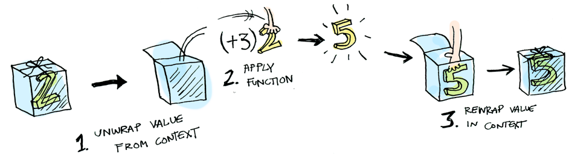
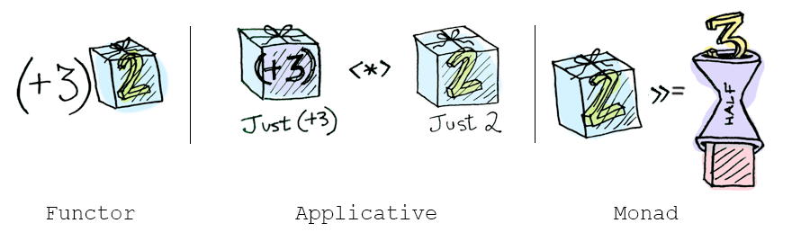

Funktoren, Applikative und Monaden in Bildern
=============================================

**Verfasst am 17. April 2013 von Aditya Bhargava**

Aktualisiert am 20. Mai 2013

Hier haben wir einen einfachen Wert: 

Außerdem wissen wir, wie wir eine Funktion auf diesen Wert anwenden können: 

Einfacher geht's nicht! Wir wollen das erweitern, indem wir festlegen, dass sich jeder Wert in einem Kontext befinden kann. Stell dir Kontexte fürs Erste als Päckchen vor, in die du Werte legen kannst: 

Wenn du jetzt eine Funktion auf einen solchen Wert anwendest, erhältst du **je nach Kontext** ein anderes Ergebnis. Genau auf diesen Gedanken basieren Applikative, Monaden, Pfeile usw. Für den `Maybe`-Datentypen sind zwei zugehörige Kontexte definiert: 

    data Maybe a = Nothing | Just a

Wir werden gleich sehen, wie sich die Anwendung einer Funktion auf ein `Just a` von einem `Nothing` unterscheidet. Als erstes wollen wir über Funktoren sprechen!

Funktoren
---------

Ist ein Wert in einen Kontext eingepackt, kann man keine normale Funktion darauf anwenden: 

An dieser Stelle kommt `fmap` ins Spiel. `fmap` kommt von der Straße, `fmap` ist ein Kontext-Hipster. `fmap` weiß, wie man Funktionen auf in einen Kontext eingepackte Werte anwendet. Stell dir zum Beispiel vor, du wolltest `(+3)` auf `Just 2` anwenden. Verwende hierfür `fmap`:

    > fmap (+3) (Just 2)
    Just 5
    

**Bäm!** `fmap` zeigt uns, wie man sowas macht! Aber woher weiß `fmap`, wie man die Funktion anwendet?

Jetzt ernsthaft: Was ist ein Funktor?
-------------------------------------

`Functor` ist eine Typenklasse („typeclass“). Sie ist folgendermaßen definiert: 

Jeder x-beliebige Datentyp kann ein `Functor` sein, solange definiert ist, wie man `fmap` darauf anwendet. So funktioniert `fmap`: 

Wir können also das hier machen:

    > fmap (+3) (Just 2)
    Just 5

Und `fmap` wendet diese Funktion auf magische Weise an, weil `Maybe` ein Funktor ist. Es gibt an, wie `fmap` `Just`s und `Nothing`s darauf anwendet:

    instance Functor Maybe where
        fmap func (Just val) = Just (func val)
        fmap func Nothing = Nothing

Das hier geschieht hinter den Kulissen, wenn wir `fmap (+3) (Just 2)` schreiben:

So, und jetzt möchtest du `fmap` einfach mal darum bitten, `(+3)` auf `Nothing` anzuwenden?

    > fmap (+3) Nothing
    Nothing
    

Genau wie Morpheus in Matrix weiß `fmap` einfach, was zu tun ist; wenn du mit `Nothing` anfängst, erhältst du `Nothing` zurück! `fmap` ist wie Zen. Nun ergibt es auch Sinn, dass es den `Maybe`-Datentypen gibt. Beispielsweise so arbeitet man mit einem Datensatz aus einer Datenbank in einer Sprache ohne `Maybe`:

    post = Post.find_by_id(1)
    if post
      return post.title
    else
      return nil
    end

Jedoch in Haskell:

    fmap (getPostTitle) (findPost 1)

Sollte `findPost` einen Post zurückliefern, erhalten wir den Titel mit `getPostTitle`. Sollte hingegen `Nothing` zurückgeliefert werden, geben wir `Nothing` zurück! Ziemlich hübsch, nicht wahr? `<$>` ist die Infix-Version von `fmap`, daher siehst du stattdessen oft folgendes:

    getPostTitle <$> (findPost 1)

Noch ein Beispiel: Was passiert, wenn du eine Funktion auf eine Liste anwendest?

Auch Listen sind Funktoren! So sieht die Definition aus:

    instance Functor [] where
        fmap = map

Okay okay, ein letztes Beispiel: Was passiert, wenn du eine Funktion auf eine andere Funktion anwendest?

    fmap (+3) (+2)

So sieht eine Funktion aus:

So sieht eine Funktion aus, die auf eine andere Funktion angewendet worden ist:

Das Ergebnis ist einfach eine weitere Funktion!

    > import Control.Applicative
    > let foo = fmap (+3) (+2)
    > foo 10
    15

Funktionen sind also auch Funktoren!

    instance Functor ((->) r) where
        fmap f g = f . g

Wenn du `fmap` auf Funktionen anwendest, führst du also einfach Funktionskomposition durch!

Applikative
-----------

Applikative heben das Ganze auf eine neue Ebene. Bei Applikativen sind unsere Werte genauso in Kontexte eingepackt wie bei Funktoren:

Aber dieses Mal sind unsere Funktionen ebenfalls in Kontexe eingepackt!

Hammer! Lassen wir das mal auf uns wirken. Applikative treiben keine Spielchen. In `Control.Applicative` ist `<*>` definiert, das weiß, wie man eine Funktion, die _in einen Kontext eingepackt ist_, auf einen Wert anwendet, der ebenfalls _in einen Kontext eingepackt ist:_

Zum Beispiel:

    Just (+3) <*> Just 2 == Just 5

Die Verwendung von `<*>` führt zu interessanten Situationen. Zum Beispiel:

    > [(*2), (+3)] <*> [1, 2, 3]
    [2, 4, 6, 4, 5, 6]
    

Hier mal etwas, das man mit Applikativen anstellen kann, aber nicht mit Funktoren. Wie wendet man eine Funktion, die zwei Argumente annimmt, auf zwei eingepackte Werte an?

    > (+) <$> (Just 5)
    Just (+5)
    > Just (+5) <$> (Just 4)
    FEHLER ??? WAS BEDEUTET DAS ÜBERHAUPT UND WARUM IST DIE FUNKTION IN EIN JUST EINGEPACKT

Applikative:

    > (+) <$> (Just 5)
    Just (+5)
    > Just (+5) <*> (Just 3)
    Just 8

`Applicative` schiebt `Functor` beiseite. „Große Jungs können Funktionen mit einer beliebigen Anzahl an Argumenten verwenden“, sagt es. „Ausgerüstet mit `<$>` und `<*>` kann ich jede Funktion annehmen, die eine beliebige Anzahl an eingepackten Argumenten erwartet. Danach übergebe ich ihr alle eingepackten Werte und bekomme einen eingepackten Wert zurück! HAHAHAHAHA!“

    > (*) <$> Just 5 <*> Just 3
    Just 15

Und hey! Es gibt eine Funktion namens `liftA2`, die dasselbe erledigt:

    > liftA2 (*) (Just 5) (Just 3)
    Just 15

Monaden
-------

Wie man etwas über Monaden erfährt:

  1. Mach den Doktor in Informatik.
  2. Wirf ihn weg, denn du brauchst ihn für diesen Abschnitt nicht!
  
Monaden fügen eine neue Wendung hinzu. Funktoren wenden Funktionen auf eingepackte Werte an:

Applikative wenden eingepackte Funktionen auf eingepackte Werte an:

Monaden wenden Funktionen, **die einen eingepackten Wert zurückliefern**, auf eingepackte Werte an. Monaden steht die Funktion `>>=` (sprich engl. „bind“) zur Verfügung, um das umzusetzen. Betrachten wir ein Beispiel. Unser gutes, altes `Maybe` ist eine Monade:

Nehmen wir an, bei `half` handele es sich um eine Funktion, die nur mit geraden Zahlen umgehen kann:

    half x = if even x
               then Just (x `div` 2)
               else Nothing

Was passiert, wenn wir sie mit einem eingepackten Wert füttern?

Wir müssen `>>=` verwenden, um unseren eingepackten Wert in die Funktion zu schieben. Hier ein Foto von `>>=`:

Und so funktioniert es:

    > Just 3 >>= half
    Nothing
    > Just 4 >>= half
    Just 2
    > Nothing >>= half
    Nothing

Was passiert darin? `Monad` ist eine weitere Typenklasse. Hier ein Teil der Definition:

    class Monad m where
        (>>=) :: m a -> m a -> (a -> m b) -> m b

Dabei ist `>>=`:

Also ist `Maybe` eine Monade:

    instance Monad Maybe where
        Nothing >>= func = Nothing
        Just val >>= func = func val

Hier siehst du sie in Aktion mit `Just 3`!

Und wenn man `Nothing` übergibt, ist es sogar noch einfacher:

`monad_nothing.png`

Man kann diese Funktionsaufrufe auch verketten:

    > Just 20 >>= half >>= half >>= half
    Nothing
    

Cool! Jetzt wissen wir also, dass `Maybe` ein `Functor`, ein `Applicative` und ein `Monad` ist. Nun wollen wir mit einem weiteren Beispiel weitermachen: der `IO`-Monade:

Genauer mit drei Funktionen. `getLine` benötigt keine Argumente und nimmt Benutzereingaben entgegen:

    getLine :: IO String

`readFile` benötigt eine Zeichenkette (einen Dateinamen) und gibt den Inhalt dieser Datei zurück:

    readFile :: FilePath -> IO String

`putStrLn` nimmt eine Zeichenkette an und gibt sie aus:

    putStrLn :: String -> IO ()

Alle drei Funktionen nehmen einen regulären oder gar keinen Wert an und geben einen eingepackten Wert zurück. Wir können sie alle mit Hilfe von `>>=` verketten!

    getLine >>= readFile >>= putStrLn

Oh ja! Wie Plätze in der ersten Reihe der Monaden-Show! Haskell bietet uns auch syntaktischen Zucker für Monaden, die `do`-Notation, an:

    foo = do
        filename <- getLine
        contents <- readFile filename
        putStrLn contents

Zusammenfassung
---------------

  1. Funktoren sind Datentypen, die die Typenklasse `Functor` implementieren.
  2. Applikative sind Datentypen, die die Typenklasse `Applicative` implementieren.
  3. Monaden sind Datentypen, die die Typenklasse `Monad` implementieren.
  4. `Maybe` implementiert alle drei und ist damit sowohl Funktor als auch Applikativ _und_ Monade.
  
Was unterscheidet die drei voneinander?

  * **Funktor:** Wende mit Hilfe von `fmap` oder `<$>` eine Funktion auf einen eingepackten Wert an.
  * **Applikativ:** Wende mit Hilfe von `<*>` oder `liftA` eine eingepackte Funktion auf einen eingepackten Wert an.
  * **Monade:** Wende mit Hilfe von `>>=` oder `liftM` eine Funktion, die einen eingepackten Wert zurück gibt, auf einen eingepackten Wert an.
  
So, mein Freund (ich glaube, dass wir mittlerweile Freunde sind), ich glaube, wir stimmen beide darin überein, dass Monaden einfach und eine KLUGE IDEE(tm) sind. Nachdem du mit diesem Guide Durst bekommen hast, warum machst du dann nicht einen auf Mel Gibson und holst dir die ganze Flasche?! Schau dir mal LYAHs Abschnitt über Monaden an. Da gibt's noch eine ganze Menge, das ich weggelassen habe, weil Miran einen großartigen Job dabei macht, mit diesem Zeug in die Tiefe zu gehen.
